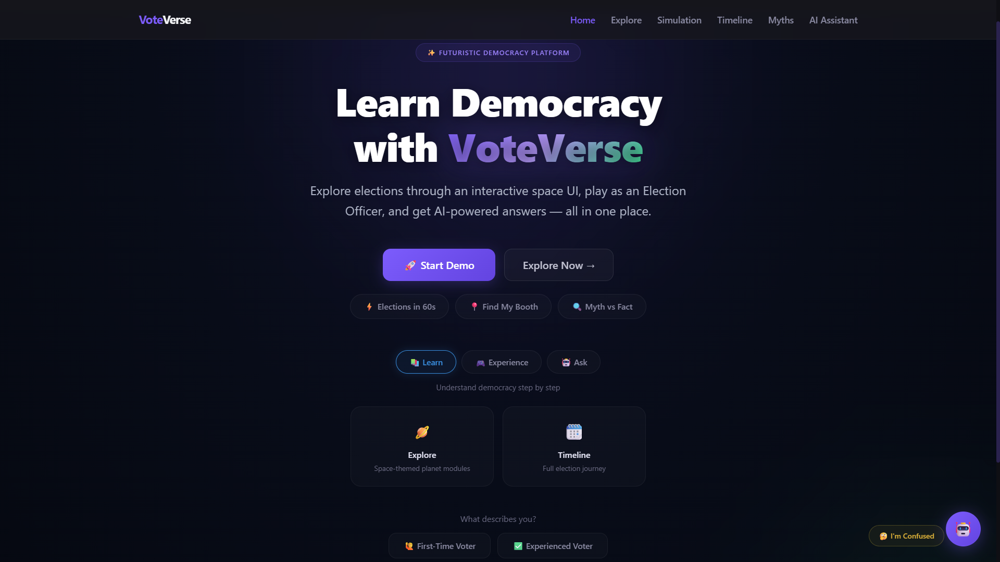
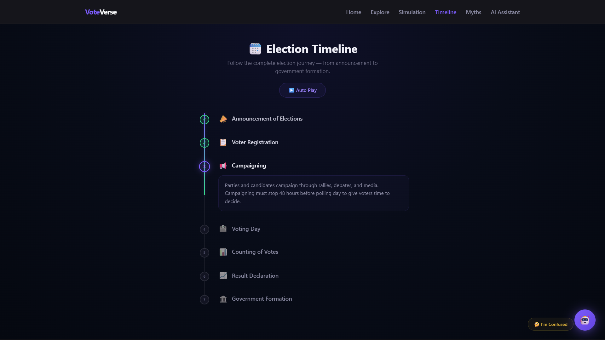
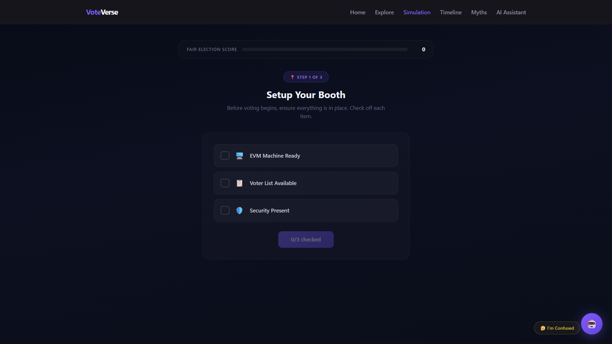
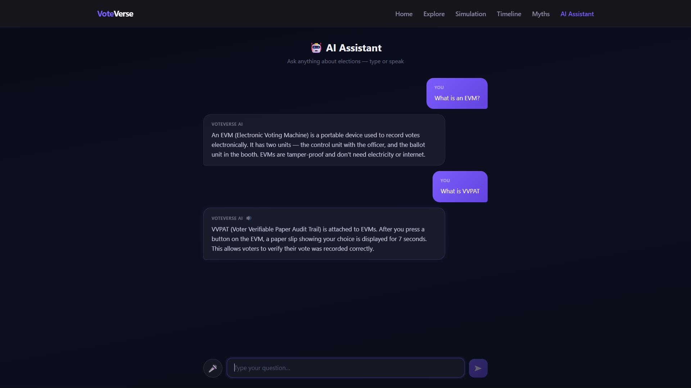
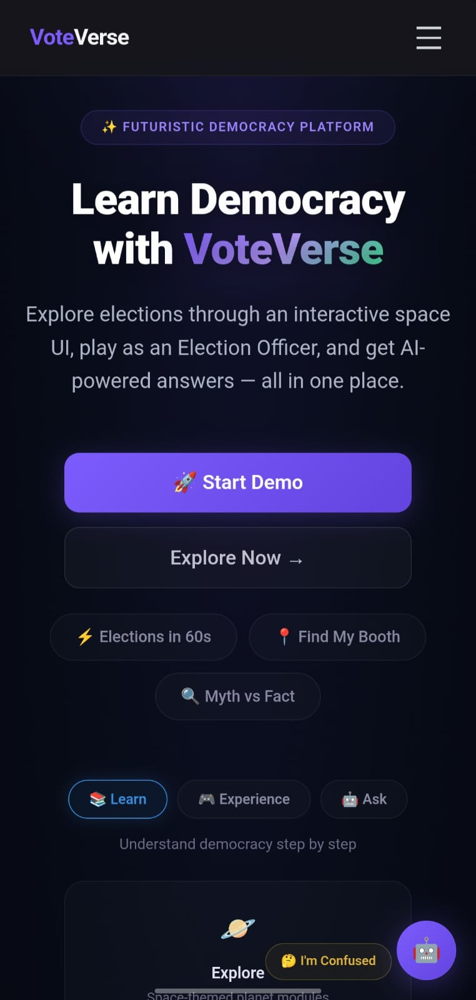

# 🚀 VoteVerse – Zero Gravity Election Experience

VoteVerse is an interactive election education platform designed to simplify the election process through immersive UI, simulations, timelines, and AI-powered assistance.

🌐 **Live Demo:** [https://voteverse-2a625.web.app](https://voteverse-2a625.web.app)

---

# 🧠 Problem Statement

Many people find the election process confusing and difficult to understand.

VoteVerse solves this problem by transforming election education into an engaging and easy-to-follow experience using:

* Interactive timelines
* Gamified simulations
* Voice + chat assistant
* Guided walkthroughs
* Futuristic zero-gravity UI

---

# ✨ Features

## 🌌 Zero Gravity Explore Mode

* Futuristic floating space-themed UI
* Interactive election modules
* Smooth animations and transitions

## ⏳ Election Timeline

* Step-by-step election journey
* Auto-play walkthrough mode
* Simple explanations for each stage

## 🎮 Simulation Mode

### Become an Election Officer

Users experience real election scenarios such as:

* Booth setup
* Voter verification
* Handling fake voter attempts
* Managing election situations

Includes:

* Fair Election Score
* Result analysis
* Decision feedback

## 🤖 AI Assistant

* Voice + chat interaction
* Quick election explanations
* “I’m Confused” helper mode
* Beginner-friendly responses

## ⚡ 1-Minute Crash Course

* Learn the entire election process in under 60 seconds
* Guided automated walkthrough

## 🗳️ Find My Booth

* Simulated polling booth finder
* Deterministic booth generation
* Consistent and realistic results

## 🧠 Myth vs Fact

Interactive section that helps users identify election misinformation.

## 🏅 Progress & Badge System

Users unlock badges such as:

* First-Time Voter
* Election Expert
* Fair Election Officer

---

# 🛠️ Tech Stack

## Frontend

* React (Vite)
* Tailwind CSS
* React Router

## Deployment

* Firebase Hosting

## APIs & Browser Features

* Web Speech API
* Speech Recognition
* Speech Synthesis

---

# 📱 Responsive Design

VoteVerse is optimized for:

* Desktop
* Tablet
* Mobile devices

---

# 🎯 Project Goal

The goal of VoteVerse is to:

* Increase election awareness
* Make democracy easier to understand
* Encourage informed participation
* Create a modern and engaging learning experience

---

# 🚀 Getting Started

## Clone the repository

```bash
git clone <YOUR_GITHUB_REPO_URL>
```

## Install dependencies

```bash
npm install
```

## Start development server

```bash
npm run dev
```

## Build for production

```bash
npm run build
```

---

## 📸 Screenshots

### Home Screen


### Timeline Mode


### Simulation


### AI Assistant


### Mobile View

---

# 🏆 Highlights

* Interactive election learning
* Gamified educational experience
* AI-powered assistance
* Voice-enabled interaction
* Fully deployed live project

---

# 👨‍💻 Author

Developed by Raghav Marda

---

# 📄 License

This project is created for educational and competition purposes.
